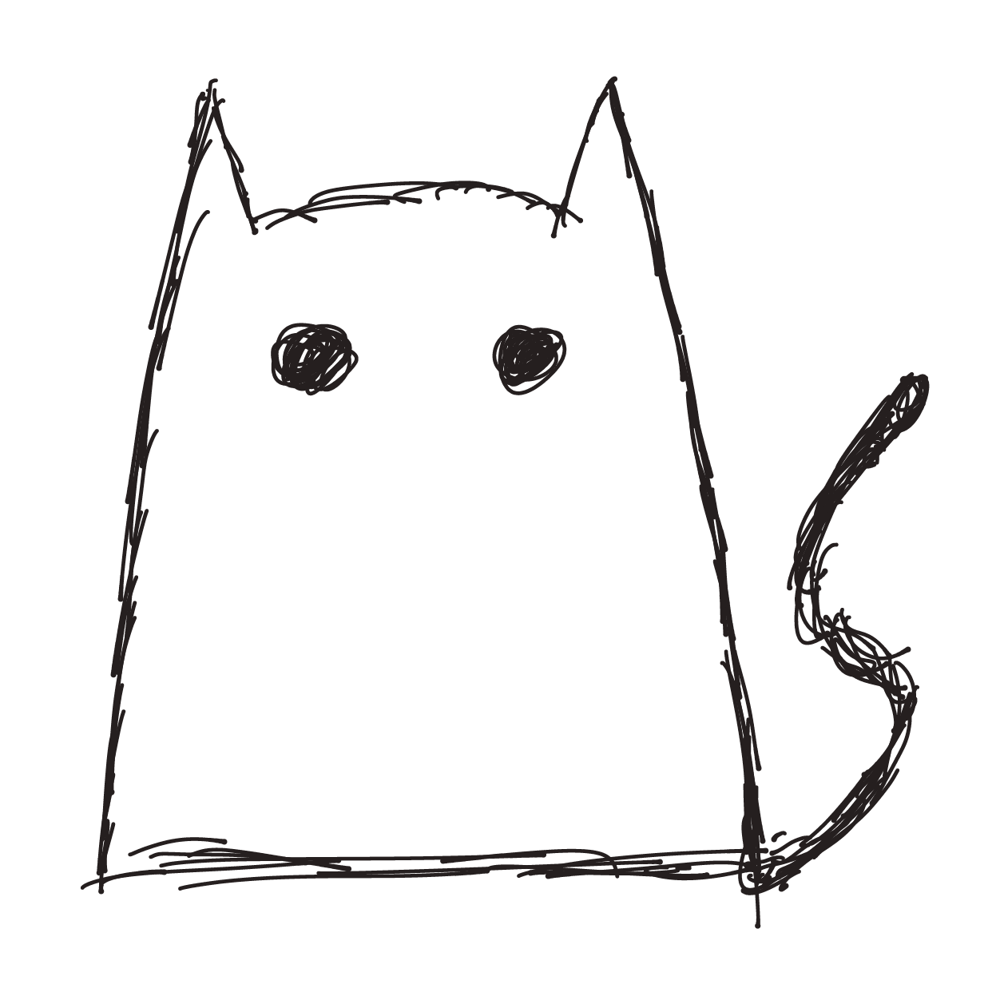
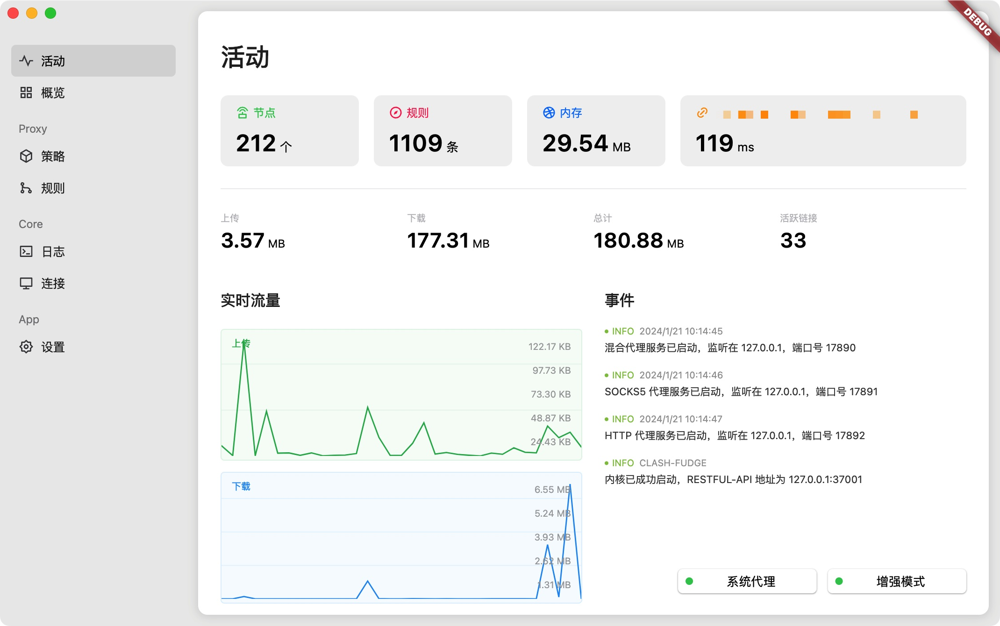
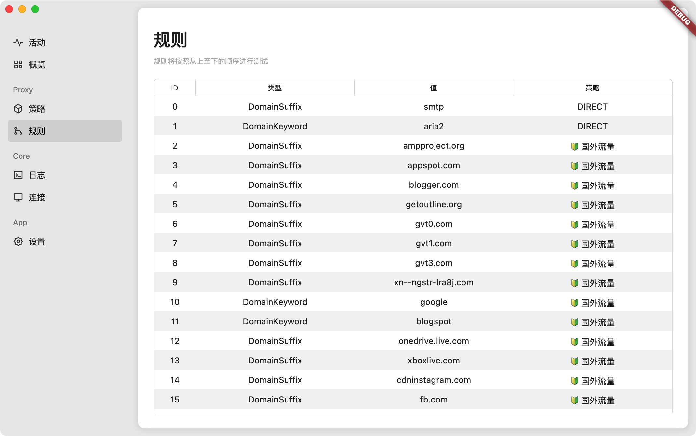
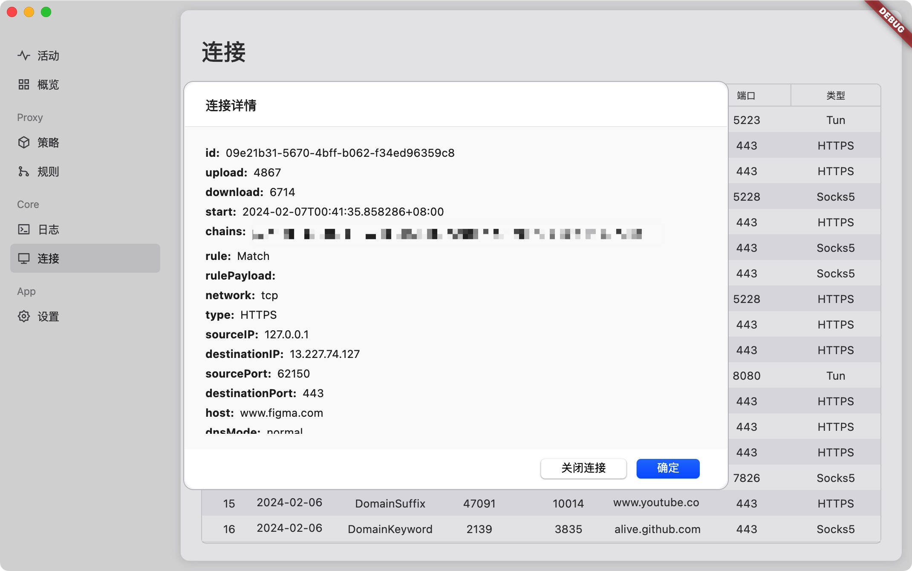
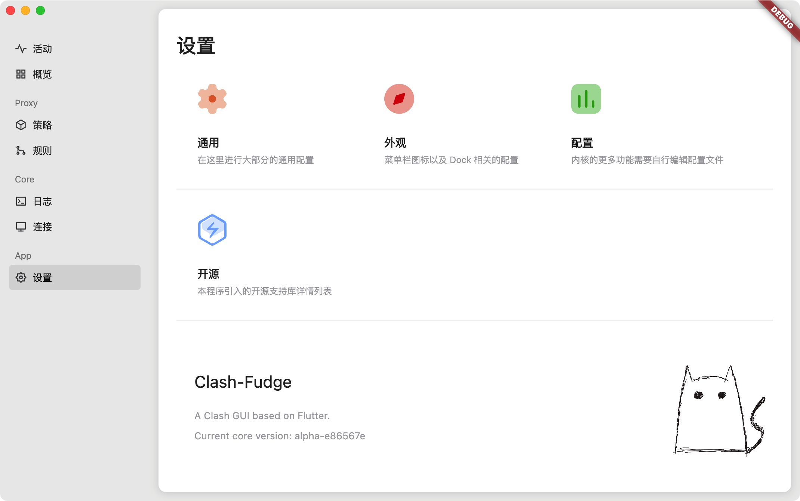

<h1 align="center">
  
  <br>
  Clash-Fudge
  <br>
</h1>

<h3 align="center">
A <a href="https://github.com/MetaCubeX/mihomo">Clash.Meta</a> GUI based on Flutter.
</h3>

## Platform Support

| Linux | macOS | Windows | Android |
| :---: | :---: | :-----: | :-----: |
|  ➖   |  ✔️   |   ➖    |   ➖    |

## Features

- Similar to a native user interface.
- Built-in support [Clash.Meta](https://github.com/MetaCubeX/Clash.Meta) core.
- Similar menu bar operation logic as ClashX.
- Tun Supported.
- Some additional custom operations.

## Preview






## Install

Download from [release](https://github.com/zsakvo/Clash-Fudge/releases).
Now it only supports macOS 10.15+

Or you can build it yourself.

## Development

You should install Flutter3.x first.

Then download the clash.meta kernel on your own, rename it as `ClashFudgeCore`, and place it in assets/core folder.

> Please note that the alpha version of the kernel has not been tested yet.

```shell
# 1. Fetch project dependencies
$ flutter pub get
# 2. Generate .g.dart file
$ dart run build_runner build --delete-conflicting-outputs
# 3. Run the project
$ flutter run -d macos
```

Or you can build it

```shell
flutter build macos
```

## Todos

> Too many, can't list them all...

### FAQ

#### 1. **macOS** "Clash-Fudge" is damaged and can't be opened

open the terminal and run `sudo xattr -r -d com.apple.quarantine /Applications/Clash-Fudge.app`

#### 2. Why does it ask for root permission when just started?

If you want to enable the Tun function, the kernel needs to run with root privileges. Currently, for convenience, the application directly requests permission at startup. In the future, we will consider changing the relevant logic.

#### 3. Is it possible to avoid having to enter a password authorization every time I start?

Of course you can. You can authorize it by going to Settings -> General -> Advanced -> Kernel Silent Privilege. Once authorized, you will no longer need to enter a password for verification.

#### 4. Why do we need to rename the kernel?

In order to avoid conflicts, the application will attempt to stop any kernel processes with the same name when it starts. To prevent unexpected accidents caused by running multiple clashes at the same time, they are given separate names.

#### 5. Why can't I access the internet after exiting the application?

If you need to exit the application, please use the 'Exit' option in the top bar icon. This operation will clear your system's proxy settings and DNS settings to avoid any networking issues. If your application is forcefully closed, the related system settings will not be automatically reset, and you will need to manually disable the relevant proxy and DNS fields.

#### 6. Some programs prompt SSL certificate errors.

Try turning off/restarting the Tun mode, it should solve the problem. There may be some bugs here, please provide relevant feedback.

#### 7. I think the app icon is very ugly.

After all, you can't expect someone who rarely picks up a pen to design a sophisticated and beautiful icon in a few minutes using a knockoff pen and drawing software downloaded temporarily on an iPad. If I really had that ability, why would I still be writing code? 🥲

## Disclaimer

This is a learning project for Flutter practice.

## Contributions

Issue and PR welcome!

## Acknowledgement

Clash-Fudge was based on or inspired by these projects and so on:

- [zzzgydi/clash-verge](https://github.com/zzzgydi/clash-verge): A Clash GUI based on tauri. Supports Windows, macOS and Linux.
- [MetaCubeX/Clash.Meta](https://github.com/MetaCubeX/mihomo): A rule-based tunnel in Go.
- [macosui/macos_ui](https://github.com/macosui/macos_ui): It provides a series of components on Flutter that resemble the native macOS style.
- [leanflutter](https://github.com/leanflutter): He has provided many excellent support libraries related to desktop platforms.

## License

GPL-3.0 License. See [License here](./LICENSE) for details.
